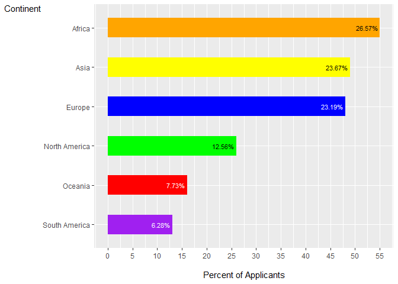

Report: Analysis of US Immigration Applicants in 2020 by Continent
================
Khawaja Hussain Ahmed

  
  

<!-- -->

**Figure 1.** Bar graph showing continent of origin of all applicants
for immigrant visas in 2020

  
  

**Frequency of Applicants by Continent:** A bar chart was created to
visualize the frequency of applicants from each continent. The chart
provides a clear representation of the number of applicants originating
from different parts of the world.

<h2>
Key Findings
</h2>

**Africa:** Africa represents a significant source of US immigration
applicants, with 55 applicants. This continent is among the top
contributors to the applicant pool, representing approximately 26.57% of
the total applicants.

**Asia:** Asia closely follows Africa with 49 applicants, accounting for
23.67% of the total applicants. It is another major contributor to US
immigration.

**Europe:** Europe is the continent of origin for 48 applicants, making
up approximately 23.19% of the total applicant pool.

**North America:** North America, which includes countries within the
continent of North America, has 26 applicants. This region represents
12.56% of the total applicants.

**Oceania:** Oceania, with 16 applicants, accounts for 7.73% of the
total applicant pool.

**South America:** South America has 13 applicants, representing 6.28%
of the total applicants.

**Conclusion:** The analysis of US immigration applicants by continent
provides valuable insights into the geographical diversity of
individuals seeking immigration to the United States. Africa, Asia, and
Europe are the primary sources of applicants, contributing significantly
to the overall applicant pool. This information is essential for
understanding the geographic origins of immigration applicants and can
assist policymakers and organizations involved in immigration-related
activities.

For a more detailed analysis, additional demographic and socio-economic
factors, as well as historical and geopolitical factors, should be
considered to gain a comprehensive understanding of the US immigration
landscape.
